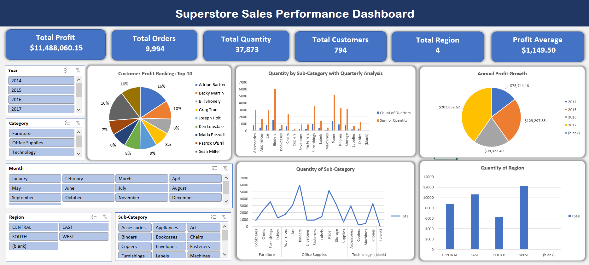

# 📊 Excel Dashboard Project (Data Cleaning & Analysis)

## 📌 Overview
This project demonstrates data cleaning, analysis, and dashboard creation using Microsoft Excel.  
The goal is to convert raw data into meaningful insights through an interactive dashboard.

## 📂 Dataset
- Dataset: Superstore Sale  Data  
- Rows: ~10,000 records  

## 🧹 Data Cleaning Process
- Removed duplicate records  
- Handled missing values  
- Standardized text  
- Formatted date columns  
  
## 📊 Dashboard Features
### KPIs 
- Total Profit  
- Total Orders  
- Total Quantity  
- Total Customers
- Total Region 
- Profit Average

### Visualizations
- Customer Profit Ranking: Top 10
- Quantity by Sub-Category with Quarterly Analysis
- Sales by Category  
- Sales by Region  
- Yearly Sales Trend  

## 🛠️ Tools & Skills Used
- Microsoft Excel
- Pivot Tables
- Pivot Charts
- Slicers & Filters
- Data Cleaning Techniques
- Dashboard Design

## 📸 Dashboard Preview

## 🚀 How to Use
1. Download the Excel file  
2. Open in Excel  
3. Use slicers to explore data  

## 👨‍💻 Author
K. Himash Madushanka

